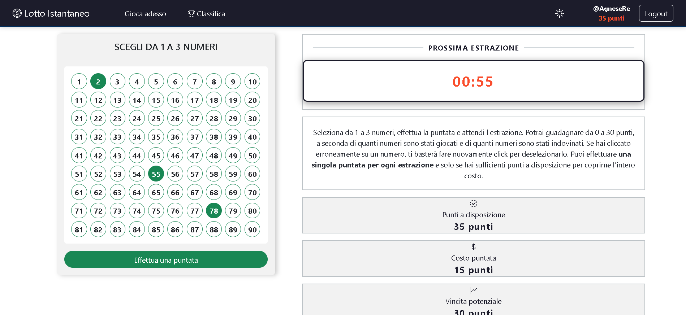

[](https://classroom.github.com/a/HF0PzDJs)
# Exam #3: "Lotto Instantaneo"
## Student: S325676 RE AGNESE 

## React Client Application Routes

- Route `/`: contiene l'homepage dell'applicazione in cui vengono presentate le regole e i dettagli del gioco. Le informazioni sono organizzate in sezioni interattive, mediante l'utilizzo di un *accordion* che consente di espandere o collassare i contenuti. Sono descritti il meccanismo di estrazione dei numeri, le condizioni per partecipare al gioco (solo utenti loggati), le condizioni per effettuare una puntata e le possibili vincite in termini di punti. Tutte le possibili combinazioni di numeri puntati e di numeri indovinati con il relativo punteggio sono mostrati in una tabella. La barra di navigazione in alto consente di spostarsi nelle differenti sezioni dell'applicazione, di passare dalla modalità scura a quella chiara e viceversa, di effettuare il login oppure il logout a seconda che l'utente sia o meno loggato. Se l'utente è loggato, la top navbar mostra inoltre il nome (*name*) e i punti a disposizione (*points*). Si tratta dell'unica pagina disponibile sia per utenti loggati che utenti non loggati.
- Route `/addBet`: contiene la pagina che consente all'utente di partecipare al gioco del *Lotto Istantaneo*, selezionando da uno a tre numeri, piazzando una puntata e visualizzando l'esito dell'estrazione. Mostra un countdown per la prossima estrazione, i punti attuali dell'utente, il costo della puntata e la vincita potenziale in base al numero di numeri selezionati. Eventuali messaggi di errore (punti non sufficienti, errato numero di numeri selezionati) o di successo (puntata correttamente piazzata) vengono visualizzati tramite un *alert*. Si tratta di una pagina disponibile ai soli utenti loggati. 
- Route `/login`: contiene la pagina di login dell'applicazione, mostrando un modulo d'accesso all'utente in cui inserire le proprie credenziali (*Email address* e *Password*). La barra di navigazione in alto consente di spostarsi nell'homepage e di impostare il tema chiaro oppure scuro. Se l'utente è già loggato, viene reindirizzato alla pagina principale (homepage).
- Route `/ranking`: contiene la pagina di classifica dell'applicazione, mostrando i tre utenti con punteggio attualmente superiore. La barra di navigazione in alto consente di spostarsi nelle diverse sezioni dell'applicazione. Se un utente non loggato tenta di accedere alla *Ranking page* viene reindirizzato alla pagina principale (homepage). 
- Route `*`: route che gestisce le rotte non definite. Qualsiasi percorso non corrispondente ad alcuna delle rotte definite, è gestito dalla rotta *. Contiene un messaggio informativo che comunica all'utente che la pagina cercata non è stata trovata. Cliccando sul bottone *Ritorna all'homepage*, l'utente è reindirizzato alla pagina principale dell'applicazione.

## API Server

*Authentication APIs*

- POST `/api/sessions`
  - *descrizione*: effettua il login dell'utente se lo username (*email*) e la password fornita sono corrette, stabilendo una sessione di login.
  - *request body*: un oggetto json contenente lo username (*email*) e la password dell'utente che desidera effettuare il login.
  - *response body*: un oggetto json contenente l'*id*, lo *username* (*email*), il nome (*name*) e i punti (*points*) dell'utente che ha effettuato il login (se il login è avvenuto con successo), altrimenti un oggetto json con un messaggio di errore (*"Incorrect username or password."*).
    - *response status code*: 200 OK, 401 Unauthorized
- GET `/api/sessions/current`
  - *descrizione*: ritorna la sessione corrente dell'utente, se presente.
  - *response body*: un oggetto json contenente l'*id*, lo *username* (*email*), il nome (*name*) e i punti (*points*) dell'utente loggato (se l'utente è loggato), altrimenti un oggetto json con un messaggio di errore (*"Not authenticated"*).
    - *response status code*: 200 OK, 401 Unauthorized
- DELETE `/api/sessions/current`
  - *descrizione*: esegue il logout dell'utente, distruggendo la corrente sessione.
  - *request body*: *none*
  - *response body*: *none* se il logout è avvenuto con successo.
    - *response status code*: 200 OK
  
*User APIs*

- PUT `/api/updatePoints/:userId`
  - *descrizione*: aggiorna i punti di un utente specifico, il cui identificativo è passato come parametro.
  - *request parameter* `userId`: identificativo univoco dell'utente di cui si vuole aggiornare il punteggio (*points*).
  - *request body*: un oggetto json contenente il numero di punti da sommare oppure da sottrarre dall'attuale punteggio dell'utente. I punti vengono sottratti nel momento in cui viene effettuata una puntata. I punti vengono sommati al momento dell'estrazione in caso di vincita.
  - *response body*: un oggetto json contenente un messaggio di conferma di avvenuta modifica del punteggio oppure un oggetto json contenente un messaggio di errore (modifica punteggio utente non esistente, modifica punteggio utente diverso da quello loggato).
    - *response status code*: 200 OK, 401 Unauthorized (utente non loggato), 403 Forbidden Error (utente loggato richiede la modifica del punteggio di un altro utente), 404 Not Found (utente non trovato), 500 Internal Server Error (errore generico).
  
  *Esempio di request body (viene effettuata una puntata su un singolo numero)*
  ``` json
  {
    "pointsToDeductOrAdd": 5
  }
  ```
  *Esempio di response body (aggiornamento punteggio avvenuto con successo)*
  ``` json
  {
    "message": "Points updated for user 1",
    "changes": 1
  }
- GET `/api/points/:userId`
  - *descrizione*: ritorna i punti di un utente specifico, il cui identificativo è passato come parametro.
  - *request parameter* `userId`: identificativo univoco dell'utente di cui si vuole ottenere il punteggio (*points*).
  - *response body*: il numero di punti dell'utente specificato oppure un oggetto json contenente un messaggio di errore.
    - *response status code*: 200 OK, 401 Unauthorized (utente non loggato), 404 Not Found (utente non trovato), 500 Internal Server Error (errore generico).
  
*Ranking APIs*

- GET `/api/rankingList`
  - *descrizione*: ritorna la *ranking list* dei tre utenti con punteggio superiore
  - *response body*: un array di oggetti json contenente le informazioni relative ai tre utenti con numero di punti superiore (*name* e *points*) oppure un oggetto json contenente un messaggio di errore nel caso in cui la richiesta non sia andata a buon fine.
    - *response status code*: 200 OK, 401 Unauthorized (utente non loggato), 500 Internal Server Error
  
  *Esempio di classifica (top 3) ritornata ad un utente loggato*
  ``` json
  [
    {
      "name": "LuigiDeRussis",
      "points": 230
    },
    {
      "name": "GuidovanRossum",
      "points": 100
    },
    {
      "name": "AnnaVerdi",
      "points": 95
    }
  ]

*Draw APIs*

- GET `/api/nextDrawTime`
  - *descrizione*: ritorna il timestamp in formato ISO 8601 della prossima estrazione.
  - *response body*: un oggetto json contenente il timestamp in formato ISO 8601 della prossima estrazione.
    - *response status code*: 200 OK, 401 Unauthorized (utente non loggato), 500 Internal Server Error (errore generico).
  
  *Esempio di timestamp in formato ISO 8601 ritornato*
  ``` json
  {
    "time": "2024-09-15T12:50:35.319Z"  // timestamp prossima estrazione
  }
- GET `/api/lastDraw`
  - *descrizione*: ritorna tutte le informazioni relative all'ultima estrazione.
  - *response body*: un oggetto json contenente tutte le informazioni relative all'ultima estrazione avvenuta (*id*, *timestamp* in formato ISO 8601, *number1*, *number2*, *number3*, *number4*, *number5*).
    - *response status code*: 200 OK, 401 Unauthorized (utente non loggato), 404 Not Found (nessuna estrazione ancora generata), 500 Internal Server Error
  
  *Esempio di ultima estrazione ritornata*
  ``` json
  {
    "id": 47,
    "timestamp": "2024-09-15T12:48:35.319Z",
    "number1": 29,
    "number2": 75,
    "number3": 67,
    "number4": 85,
    "number5": 48
  }
*Bet APIs*

- GET `/api/currentBet/:userId`
  - *descrizione*: ritorna la puntata corrente di un certo utente, se esiste.
  - *request parameter* `userId`: identificativo univoco dell'utente di cui si richiede la puntata corrente.
  - *response body*: un oggetto json contenente tutte le informazioni riguardanti la puntata corrente di un certo utente (*userId*, *drawId* inizializzato a null, *timestamp* in formato ISO 8601, *number1*, *number2*, *number3*, *earnedPoints* inizializzato a null) oppure un oggetto json contenente un messaggio di errore (*e.g. "No bets placed yet for this draw by User with ID 1") in caso di mancata puntata corrente. Un'utente loggato può richiedere solamente la propria puntata corrente, non quella di altri utenti.
    - *response status code*: 200 OK, 401 Unauthorized (utente non loggato), 403 Forbidden Error (utente loggato richiede puntata corrente di un altro utente), 503 Service Unavailable (errore generico).
  
  *Esempio di puntata corrente ritornata ad un utente loggato (lo stesso che ha effettuato la puntata)*
  ``` json
  {
    "userId": "1",
    "drawId": null, // campo inizializzato a null, valorizzato al momento dell'estrazione
    "timestamp": "2024-09-15T12:23:00.423Z",
    "number1": 4,
    "number2": 58,
    "number3": 20,
    "earnedPoints": null  // campo inizializzato a null, valorizzato al momento dell'estrazione (calcolo punti guadagnati)
  }
  ```

  *Esempio di puntata corrente ritornata ad un utente loggato (diverso da colui che ha effettuato la puntata)*
  ``` json
  {
    "error": "You are not authorized to get the current bet of another user"
  }
- POST `/api/submitBet`
  - *descrizione*: sottomette una puntata (da 1 a 3 numeri distinti compresi tra 1 e 90).
  - *request body*: un oggetto json contenente le informazioni relative alla puntata da effettuare (*userId*, *timestamp* in formato ISO 8601 in cui viene effettuata la puntata, *number1*, *number2*, *number3*).
  - *response body*: *none* oppure un oggetto json contenente un messaggio di errore.
    - *response status code*: 201 Created, 401 Unauthorized (utente non loggato), 403 Forbidden Error (punti insufficienti, puntata già effettuata per la successiva estrazione, puntata con *userId* diverso da quello dell'utente loggato), 503 Service Unavailable (errore generico).

  *Esempio di request body (utente loggato effettua una puntata su 3 distinti numeri)*
  ``` json
  {
    "userId": 1,
    "timestamp": "2024-09-15T22:32:10.423Z",
    "number1": 4,   // non può essere null (utente deve puntare su almeno un numero). Compreso tra 1 e 90
    "number2": 58,  // può essere null oppure compreso tra 1 e 90
    "number3": 20   // può essere null oppure compreso tra 1 e 90
  }
  
- GET `/api/earnedPoints/:userId/:drawId`
  - *descrizione*: ritorna il numero di punti guadagnati da un certo utente in una determinata estrazione.
  - *request parameters*: `userId` identificativo univoco dell'utente, `drawId` identificativo univoco dell'estrazione. Ciascuna puntata è univocamente identificata dalla coppia (*userId*, *drawId*).
  - *response body*: il numero di punti guadagnati oppure un oggetto json contenente un messaggio di errore.
    - *response status code*: 200 OK, 500 Internal Server Error (errore generico)

## Database Tables

- Table `User` - contiene le informazioni relative a tutti gli utenti registrati (id*, name, email, password, salt, points). L'utente effettua il login tramite email e password. Il campo *password* contiene il digest risultante dalla combinazione del *salt* e della password in chiaro.
- Table `Draw` - contiene tutte le informazioni relative ad un'estrazione (id*, timestamp, number1, number2, number3, number4, number5). Ogni due minuti viene generata una nuova estrazione.
- Table `Bet` - contiene tutte le informazioni relative ad una puntata effettuata (userId*, drawId*, timestamp, number1, number2, number3, earnedPoints). I campi *drawId* e *earnedPoints*, inizialmente settati a *NULL*, sono valorizzati al momento dell'estrazione. Quando valorizzato, il campo *drawId* contiene l'identificativo univoco dell'estrazione a cui la puntata fa riferimento. Il campo *earnedPoints* contiene il numero di punti guadagnati (0, 10, 20 oppure 30).

## Main React Components

- `App` (in `App.jsx`): è la componente principale dell'applicazione. Avvolge tutti i componenti in un *ThemeContext.Provider* per gestire il tema (chiaro oppure scuro) e utilizza *Routes* e *Route* di *react-router-dom* per definire la navigazione.
- `LoginForm` (in `AuthComponents.jsx`): contiene il form per effettuare il login, con i due campi di input necessari (*Email address* e *Password*). Controlla le credenziali inserite (dopo aver cliccato sul bottone *Login*) e reindirizza l'utente alla pagina in cui effettuare una puntata, in caso di login effettuato con successo. Il form contiene anche un bottone *Continua come ospite* che rimanda l'utente alla pagina contenente le regole del gioco (homepage), senza aver concluso la procedura di login.
- `LottoPicker` (in `LottoPicker.jsx`): contiene il form per effettuare una puntata e tutte le informazioni utili riguardanti la prossima estrazione, il numero di punti ancora a disposizione dell'utente, il numero di punti necessari per effettuare una certa puntata e il numero potenziale di punti guadagnabili. L'utente seleziona da 1 a 3 numeri (compresi tra 1 e 90) dalla griglia proposta. La puntata viene sottomessa (dove aver cliccato il bottone *Effettua una puntata* e dopo aver verificato che il numero di punti a disposizione dell'utente siano sufficienti a coprirne l'intero costo). Al momento dell'estrazione, viene mostrato un messaggio appropriato all'utente relativo all'esito dell'estrazione (numeri estratti, quantità di numeri indovinati e numero di punti eventualmente vinti).
- `NavHeader` (in `NavHeader.jsx`): la navbar dell'applicazione, responsabile della navigazione all'interno dell'applicazione. Contiene link che reindirizzano l'utente alla pagina contenente le regole del gioco (homepage), alla pagina in cui effettuare una puntata (se loggato) e alla pagina contenente la classifica dei tre giocatori con punteggio superiore (se loggato). Contiene i bottoni *Login*/*Logout* e alcune informazioni riguardanti l'utente loggato (*name* e *points*). Un bottone (con icona bootstrap *bi-sun* o *bi-moon*) consente inoltre di impostare la modalità chiara o la modalità scura (*dark mode* oppure *light mode*).
- `NotFoundComponent` (in `NotFoundComponent.jsx`): contiene un messaggio informativo che comunica all'utente che la pagina cercata non è stata trovata. Presenta un bottone *Ritorna all'homepage* che reindirizza l'utente alla pagina principale dell'applicazione.
- `RankingTable` (in `RankingTable.jsx`): recupera dal server le informazioni relative ai tre utenti con punteggio superiore (*rankingList*) e predispone una tabella.
  - `RankingRow` (in `RankingTable.jsx`): responsabile della visualizzazione della classifica. Mostra la posizione, il nome e il punteggio di ciascun utente.
- `RulesComponent` (in `RulesComponent.jsx`): contiene tutte le regole del gioco (funzionamento e limiti delle puntate, gestione del budget, esiti e vincite). Mostra una tabella con tutte le possibili combinazioni di numero di *numeri puntati* e numero di *numeri indovinati* con relativo punteggio ottenibile.

## Screenshot

L'utente loggato può selezionare da uno a tre numeri, compresi tra 1 e 90, dalla griglia proposta. I punti attualmente a disposizione (*e.g* 35 punti), il costo della puntata (*e.g.* 15 punti) e la vincita potenziale (*e.g.* 30 punti) sono mostrati a lato. Il countdown, nella forma *mm:ss*, mostra il tempo rimanente per effettuare una puntata per la successiva estrazione.



L'utente effettua una puntata. I punti a disposizione vengono aggiornati (*e.g.* 20 punti) e il bottone *Effettua una puntata* viene disabilitato. L'utente può effettuare una sola puntata per estrazione.


Allo scadere del tempo, viene generata una nuova estrazione. Un messaggio informativo comunica all'utente l'esito dell'estrazione (quali numeri sono stati estratti e punti eventualmente guadagnati). Il bottone *Chiudi* presente nel footer del modale consente la chiusura del messaggio. Si può effettuare una nuova puntata.


## Users Credentials

- agnesere@gmail.com, prova
- fulvio.corno@polito.it, prova (utente con punti non sufficienti per effettuare una puntata)
- luigi.derussis@polito.it, webapp1
- laura.farinetti@polito.it, webapp1
- guidovanrossum@python.org, python_2023
- anna.verdi.90@gmail.com, evviva
